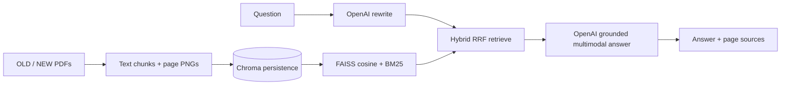

# IRAG for Automotive Hardware Schematics

A multimodal hybrid-RAG assistant and schematic revision-diff tool for automotive domain-controller bring-up. It ingests OLD/NEW schematic PDFs (including 100-page documents), retrieves exact signal evidence, extracts structured SoC-to-peripheral connections, and generates a software-impact report for IOMUX, drivers, power sequencing, and configuration.

## Architecture



The responsibilities stay deliberately separate:

- **Chroma** persistently stores chunk text, version/page metadata, and normalized local vectors.
- **FAISS + BM25** performs actual hybrid retrieval. Dense cosine and sparse ranks are fused using Reciprocal Rank Fusion; Chroma is not substituted for this ranked path.
- **OpenAI** rewrites questions and reasons over source-tagged text plus only the retrieved page images.
- **LangGraph** is the chatbot's compiled, typed `rewrite → retrieve → generate` workflow.

All implementation remains in `schematic_diff_agent.py`, as required by the customer tool convention.

## Setup

Python 3.10+ is required.

```powershell
python -m venv .venv
.venv\Scripts\Activate.ps1
python -m pip install -r requirements.txt
Copy-Item .env.example .env
```

Set `OPENAI_API_KEY` in `.env`. Never commit the real file. The local `all-mpnet-base-v2` embedding model downloads on first use.

## One-command rubric demo

The dedicated demo executes the complete mandatory path—ingest both documents, construct Chroma plus FAISS/BM25 indexes, invoke the typed LangGraph, and print the original query, rewrite, scored chunks, grounded answer, and sources:

```powershell
python demo.py `
  --old .\data\old_schematic.pdf `
  --new .\data\new_schematic.pdf `
  --question "What changed in FlexCAN0 and what must software update?"
```

See `data/README.md` for proprietary-data handling and `DELIVERY_MANIFEST.md` for the final handoff checklist.

## End-to-end schematic comparison

```powershell
# 1. Ingest and render each revision
python schematic_diff_agent.py ingest --label OLD --pdf .\old.pdf
python schematic_diff_agent.py ingest --label NEW --pdf .\new.pdf

# 2. Persist in Chroma and build FAISS+BM25
python schematic_diff_agent.py build-index

# 3. Extract source-grounded connection tables
python schematic_diff_agent.py extract --label OLD --out .\work\OLD\connections.md
python schematic_diff_agent.py extract --label NEW --out .\work\NEW\connections.md

# 4. Produce software-impact Markdown and normalized CSV
python schematic_diff_agent.py compare `
  --old .\work\OLD\connections.md `
  --new .\work\NEW\connections.md `
  --out .\work\impact_report.md `
  --export-csv .\work\impact_report.csv

# 5. Validate extracted SoC ports against retrieved PDF text
python schematic_diff_agent.py validate --label NEW
```

Extraction sends at most 20 images by default and selects only pages represented in retrieved chunks. For large PDFs:

```powershell
python schematic_diff_agent.py extract --label NEW --out .\work\NEW\connections.md --max-images 12
```

Use `--no-images` for text-only processing and `--openai-model` to override `OPENAI_MODEL`.

## Chatbot

```powershell
python schematic_diff_agent.py chat `
  --q "What changed in the FlexCAN0 TXD connection and what must software update?" `
  --version NEW `
  --k 10
```

Output includes the original and rewritten query; RRF, dense cosine-similarity, and BM25 scores; ranked text previews; the final grounded answer; and version/source/page citations. RRF is clearly labeled as a fusion score rather than a similarity. If rewriting fails, the graph safely retrieves with the original query. If retrieval returns nothing, generation is skipped and an insufficient-evidence response is returned.

Raw retrieval remains available for engineering spot checks:

```powershell
python schematic_diff_agent.py query --q "FlexCAN0 TXD RXD PB_01" --version NEW --k 10
```

## Runtime artifacts

```text
work/
├── OLD/
│   ├── chunks.json
│   ├── pages/page_001.png ...
│   ├── connections.md
│   └── validation_report.md
├── NEW/...
├── _chroma/             # persistent chunk/vector corpus
├── _index/
│   ├── dense.faiss      # normalized inner-product cosine index
│   └── store.pkl        # ordered chunks, metadata, BM25
├── impact_report.md
└── impact_report.csv
```

Changing the embedding model requires rebuilding. The loader checks `FAISS index.d` against the active model dimension and gives a clear deletion/rebuild instruction on mismatch. Chroma also records the vector dimension and recreates an incompatible collection during `build-index`.

## Tests

```powershell
$env:PYTEST_DISABLE_PLUGIN_AUTOLOAD='1'
python -m pytest test_schematic_diff_agent.py -q -p no:cacheprovider
python -m ruff check schematic_diff_agent.py test_schematic_diff_agent.py
python -m py_compile schematic_diff_agent.py
```

Tests mock PDFs, OpenAI, Chroma initialization, and external state. They cover chunking/metadata, tokenization, hybrid RRF ordering, version filtering, source formatting, OpenAI invocation/configuration, dimension mismatch, Markdown parsing, rewrite fallback, exact LangGraph node order, and deterministic end-to-end grounded chat state.

## Limitations

- PDF text extraction may miss labels represented only as vectors or images; retrieved page vision mitigates this.
- OCR is not included. Scanned schematics require an OCR preprocessing step.
- RRF scores are rank-fusion scores, not probabilities or cosine similarities.
- Generated findings should be reviewed by a hardware engineer before software changes are merged.
- `store.pkl` is trusted local runtime state and must not be loaded from untrusted sources.

## Academic-integrity disclosure

The pipeline internals are implemented directly in Python; no Flowise, Dify, n8n, or other opaque end-to-end builder is used. OpenAI Codex assisted with repository migration, implementation, tests, and documentation. Runtime model usage is also disclosed in `REPORT.md`. The submitting team remains responsible for reviewing, understanding, and presenting the work.
