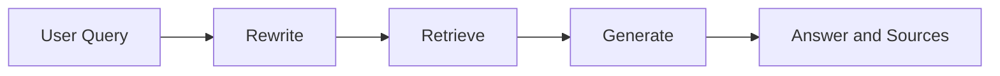

# Egyptian Private Universities — Intelligent RAG

A transparent retrieval-augmented question-answering assistant over a locally stored UniversitiesEgypt dataset. A compiled LangGraph state graph executes the only production question path: `rewrite → retrieve → generate`. The CLI prints the original and rewritten queries, ranked cosine similarities, metadata, a grounded answer, and sources.

## Architecture



- **Data:** 231 JSON-lines records; each line is a scraped university subpage. The aligned links file contains its source URL.
- **Chunking:** page-aware, newline/paragraph-first packing. Only an oversized semantic unit uses a character window. Defaults are 1,200 characters and 180-character overlap.
- **Embeddings:** local `sentence-transformers/all-MiniLM-L6-v2` (384 dimensions).
- **Store:** persistent Chroma using cosine distance; displayed scores are explicitly converted to `1 - distance` and labeled `cosine_similarity`.
- **LLM:** OpenAI for rewriting and grounded generation. A failed rewrite falls back to the original query.
- **State:** typed `RAGState` with original/rewritten query, retrieved chunks, answer, normalized sources, and optional error.

The checked-in dataset loader supports the format used by this project: UTF-8 JSON-lines containing one JSON string per record, plus an optional line-aligned URL file. Malformed and empty records are skipped safely. No unnecessary document formats are hidden behind a framework.

## Setup

Python 3.11+ is recommended.

```powershell
python -m venv .venv
.venv\Scripts\Activate.ps1
python -m pip install -r requirements.txt
Copy-Item .env.example .env
```

Set `OPENAI_API_KEY` in `.env`. Do not commit `.env`; it is ignored. The embedding model downloads from Hugging Face on first use.

## Index and ask

```powershell
python -m school_rag.ingest
python -m school_rag.app --question "When was Future University in Egypt founded?"
python -m school_rag.app --question "ما هو عنوان مدينة زويل؟" --top-k 3
python -m school_rag.evaluate
```

The index command fingerprints stable chunk IDs plus the embedding model and reuses an unchanged index. Use `python -m school_rag.ingest --force` to rebuild it explicitly. Generated `.chroma` data is ignored by Git.

`school_rag.evaluate` executes the five committed questions and writes complete rewritten queries, ranked chunks/scores, answers, and sources to the ignored `evaluation/results.json` artifact.

Example output shape:

```text
Original query: When was Future University in Egypt founded?
Rewritten query: Future University in Egypt founding year

Retrieved chunks:
1. 0.xxxx cosine_similarity | Future University in Egypt - FUE — About (record 1)

Answer:
Future University in Egypt was founded in 2006. [Source 1]

Sources:
[Source 1] Future University in Egypt - FUE — About ...
```

An optional existing UI remains available:

```powershell
streamlit run app.py
```

## Configuration

All settings are centralized in `school_rag/config.py` and may be overridden with `.env`: data/link paths, Chroma path/collection, model names, chunk size/overlap, top-k, and temperature. `OPENAI_API_KEY` is the only secret and is never printed.

## Tests and validation

```powershell
$env:PYTEST_DISABLE_PLUGIN_AUTOLOAD='1'
python -m pytest tests -q -p no:cacheprovider
python -m ruff check school_rag tests app.py
python -m compileall -q school_rag
```

The suite mocks external model calls and includes a deterministic end-to-end graph test proving expected-source retrieval and a cited answer. See [REPORT.md](REPORT.md) for the design rationale, evaluation, and assignment checklist.

## Known limitations

- The compact English MiniLM model is fast and free, but direct Arabic retrieval is weaker; the rewrite node mitigates this by translating queries to English.
- The source is a static scrape and may be stale or contain promotional/user-review text. Answers should not be treated as authoritative admissions advice.
- Source “page” metadata is the dataset record number, not a PDF page.
- LLM grounding is prompt-enforced; citation-entailment checking is a sensible production extension.
