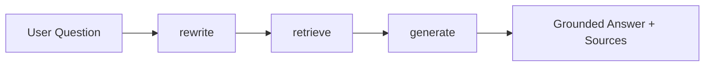

# Wiyse School Intelligent RAG System — Schematic IRAG Report

## Executive summary

Schematic IRAG is an AI-powered question-answering assistant for automotive domain-controller hardware schematics. It ingests two board revisions (normally `OLD` and `NEW`), constructs a versioned knowledge base, retrieves relevant pages using local hybrid search, and asks OpenAI to produce a strictly grounded answer with page citations. It also extracts structured SoC-to-peripheral connections and generates a software-impact diff covering IOMUX, drivers, added/removed links, and power sequencing.

The mandatory question path is a compiled LangGraph state graph with the exact nodes `rewrite → retrieve → generate`.

## Part 0 — Data and chunking strategy

### 0.1 Dataset selection

The selected dataset is a pair of proprietary automotive electronic-schematic PDFs representing two revisions of the same domain-controller board:

- `OLD`: the currently supported board revision.
- `NEW`: the delivered hardware revision being brought up.

The source is the customer's hardware engineering release package. PDF was retained because it preserves page boundaries, printed identifiers, and the visual net/pin topology needed for multimodal analysis. Each PDF can contain approximately 100 pages, so the intended delivery knowledge base is **two documents and up to approximately 200 page records**. Exact filenames, page counts, extracted chunk counts, and rendered image counts are printed by `ingest`; proprietary PDFs and generated artifacts are intentionally excluded from Git.

The PDFs contain two complementary structures:

1. Extractable page text: component references, part numbers, pin labels, net names, rail names, and notes.
2. Visual page content: wires, symbols, spatial relationships, and labels that PDF text extraction may order imperfectly or omit.

Each chunk stores `version`, source filename, and one-based PDF page number. The corresponding rendered PNG path is stored in the version's `chunks.json`. A SHA-256 identifier derived from version/source/page/content is used when the chunk is mirrored into Chroma.

### 0.2 Natural unit of meaning

The page is the strongest stable semantic and citation boundary. Unlike prose, a schematic page does not have reliable paragraphs: PyMuPDF often returns spatial labels in drawing order. A complete electrical connection may span nearby labels and symbols, while a 100-page whole-document embedding would mix unrelated subsystems.

Typical questions contain exact identifiers and relationships, for example:

- “Where does FlexCAN0 TXD connect in NEW?”
- “Did QSPI_A_CS0 move to another SoC port?”
- “Which rail powers the new Ethernet transceiver?”
- “What software configuration changed between OLD and NEW?”

These queries benefit from chunks large enough to retain a cluster of related labels, plus lexical retrieval that does not smooth away exact identifiers.

### 0.3 Implemented chunking strategy

For every page, extracted text is split with the customer-approved sliding window:

- Default chunk size: **1,500 characters**.
- Default overlap: **300 characters**.
- Step size: **1,200 characters**.
- Chunks never cross page boundaries.
- Empty-text pages generate no text chunk but are still rendered at 150 DPI.

The overlap protects connections whose component/net labels fall at a window boundary. Page metadata restores the visual and source context. Both values are configurable with `--chunk-size` and `--overlap`, and invalid combinations fail immediately.

### 0.4 Alternatives considered and rejected

- **Whole document per embedding:** rejected because unrelated interfaces across up to 100 pages dilute similarity and exceed useful model context.
- **Whole page only:** rejected because dense pages may contain many unrelated circuits and too much text for a focused embedding.
- **Sentence/paragraph splitting:** rejected because schematic text is not prose and extraction order does not reliably represent sentences.
- **OCR-only ingestion:** rejected as the default because born-digital PDF text is faster and preserves exact identifiers better. OCR remains a future fallback for scanned pages.
- **Image-only embeddings:** rejected because exact identifiers such as `PB_01`, `TJA1043`, and `RESET_B` are especially valuable to BM25 and direct text citations.
- **Fixed chunks without overlap:** rejected because cutting a net/pin cluster at a boundary can destroy the answer.

### 0.5 Weaknesses and mitigations

The character window is not truly topology-aware, PDF extraction may omit vector-only labels, and connections may span multiple pages. Mitigations are page metadata, 20% overlap, dense plus exact-token retrieval, 16 interface seed searches for extraction, and OpenAI vision over only the retrieved page images. A future version should add schematic-aware region detection, OCR fallback, or machine-readable netlist ingestion.

## Level 1 — Foundation

### 1.1 Data ingestion

`ingest` uses PyMuPDF to open each PDF, extract text page by page, apply the window strategy, and render every page to PNG. It writes a self-contained file-backed stage artifact:

```json
{
  "chunks": ["..."],
  "metadata": [{"version": "OLD", "source": "old.pdf", "page": 22}],
  "images": ["work/OLD/pages/page_001.png"],
  "source": "old.pdf"
}
```

This format allows every later CLI stage to restart without hidden in-memory state.

### 1.2 Embedding and indexing

The local embedding model is `sentence-transformers/all-mpnet-base-v2`:

- 768-dimensional vectors.
- Strong English semantic retrieval quality for technical text.
- Local CPU execution and no embedding API cost.
- Good fit for the primarily English identifier-rich schematics.
- Limited direct multilingual support; the OpenAI rewrite node translates non-English questions into English before retrieval.

Vectors are converted to `float32` and L2-normalized. They are persisted with documents and metadata in Chroma and added to `faiss.IndexFlatIP`; normalized inner product is cosine similarity. BM25 indexes lowercase alphanumeric/underscore tokens, preserving exact hardware identifiers. The FAISS index dimension is checked against the active embedding model on load. Chroma stores its dimension and is recreated safely if a different model dimension is detected during rebuild.

Chroma was chosen for durable inspectable chunk storage; FAISS was retained for fast local dense search and compatibility with the customer's tool. Generated indexes are excluded from Git and rebuilt with:

```powershell
python schematic_diff_agent.py build-index
```

### 1.3 Basic and hybrid retrieval

For each rewritten query:

1. Embed and normalize the query.
2. Retrieve dense FAISS cosine ranks.
3. Retrieve BM25 keyword ranks.
4. Fuse the independent ranks with `1 / (60 + rank)`.
5. Sort by descending RRF score and return configurable top-k results.
6. Optionally filter to one version without starving that version's candidates.

Every result retains:

- Rank and RRF fusion score.
- Underlying dense cosine similarity.
- Underlying raw BM25 score.
- Score type (`rrf`).
- Version, filename, PDF page, and text preview.

The CLI labels these values separately: RRF is not presented as a probability or cosine similarity.

### 1.4 Grounded answer generation

The generation prompt contains the original question, rewritten query, and numbered source-tagged context blocks. OpenAI receives only the retrieved page images, sorted by page and capped globally at 20 for large documents. Instructions require the model to:

- Use only supplied schematic evidence.
- Avoid unsupported outside knowledge.
- Cite claims as `[VERSION: ..., SOURCE: ..., PAGE: ...]`.
- State explicitly when evidence is insufficient.
- Mention software impact only when the evidence supports it.

If retrieval returns no chunks, the graph does not call OpenAI for generation and returns a deterministic insufficient-evidence response. The final CLI output includes the answer and normalized sources.

## Level 2.1 — Query rewriting

The `rewrite` node uses OpenAI with a dedicated search-query prompt. It clarifies wording, translates to English where needed, and preserves signal names, component references, pins, numbers, and revision labels. It is forbidden to answer or introduce facts. The CLI displays both original and rewritten queries. If rewriting fails, retrieval continues with the original query and the state exposes an error note.

## LangGraph orchestration

`SchematicRAGState` is a `TypedDict`. Nested `RetrievedSchematicChunk` and `SchematicSource` records are also typed. State includes original/rewritten query, optional version, top-k, OpenAI model, image flag, retrieved chunks with scores/metadata, answer, normalized sources, and optional error.



Node responsibilities are deliberately narrow:

- `rewrite`: owns `rewritten_query` and optional fallback `error`.
- `retrieve`: owns `retrieved_chunks`.
- `generate`: owns `answer` and `sources`.

`SchematicDiffAgent.graph` is compiled during construction, and `chat()` invokes that graph. There is no separate primary chatbot path.

## End-to-end demonstration

```powershell
python schematic_diff_agent.py ingest --label OLD --pdf .\old.pdf
python schematic_diff_agent.py ingest --label NEW --pdf .\new.pdf
python schematic_diff_agent.py build-index
python schematic_diff_agent.py chat `
  --q "What changed in the FlexCAN0 TXD connection and what must software update?" `
  --k 10
```

For the submission checklist, `demo.py` wraps this mandatory sequence into one reproducible command while still calling the same transparent implementation methods:

```powershell
python demo.py --old .\data\old_schematic.pdf --new .\data\new_schematic.pdf
```

The same repository also provides structured extraction, version comparison, CSV export, and evidence validation. These are customer extensions beyond the mandatory QA rubric.

## Testing and verification

The deterministic test suite mocks PDFs, Chroma startup, and OpenAI. It covers loading/chunk boundaries, metadata, tokenization, RRF ordering, version filtering, score semantics, source formatting, OpenAI configuration, dimension mismatch, rewrite fallback, no-results behavior, exact graph order, and full graph state flow with a cited answer.

Latest local result: **10 tests passed**, Ruff passed, and Python compilation passed. Live validation still requires the proprietary customer PDFs, a first-time embedding-model download, and a configured `OPENAI_API_KEY`.

## Limitations and future work

- Proprietary PDF documents are not committed, so exact live document/page/chunk counts must be recorded after customer ingestion.
- Scanned pages need OCR preprocessing.
- Prompt grounding should be supplemented with citation-entailment checking in safety-critical production use.
- Generated hardware/software impact must receive human engineering review.
- `store.pkl` is trusted local runtime state and must not be accepted from untrusted sources.

## AI-tool disclosure

OpenAI Codex assisted with migration, implementation, tests, and documentation. The runtime uses OpenAI for query rewriting and grounded multimodal generation, while local SentenceTransformers performs retrieval embeddings.

## Rubric completion checklist

- [x] Domain-specific PDF knowledge base defined.
- [x] Dataset source, structure, and approximate document/page count documented.
- [x] Data-driven chunking strategy, rejected alternatives, weaknesses, and mitigations documented.
- [x] PDF ingestion, preprocessing, page rendering, and chunk metadata implemented.
- [x] SentenceTransformer embedding model selected and justified by language, dimension, speed, and cost.
- [x] Chroma and FAISS persistent indexing implemented.
- [x] Configurable top-k retrieval with cosine, BM25, and correctly labeled RRF scores.
- [x] Retrieved previews and source metadata displayed.
- [x] Strict grounded OpenAI answer generation with citations and insufficient-evidence handling.
- [x] LLM query rewriting, English translation instruction, and failure fallback.
- [x] Original and rewritten queries displayed.
- [x] Typed LangGraph state with exact `rewrite → retrieve → generate` nodes.
- [x] Mermaid graph diagram included.
- [x] End-to-end CLI demo documented.
- [x] Dependencies and safe `.env.example` included.
- [x] Automated unit and deterministic end-to-end graph tests included.
- [ ] Customer must add the proprietary PDFs, run the live demo, record exact ingestion counts, and publish the repository URL before submission.
