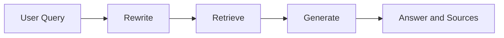

# Wiyse School Intelligent RAG System — Technical Report

## 1. Existing implementation and gap analysis

The starting repository was a Streamlit prototype about Egyptian private universities. It had a `TypedDict`, a LangGraph-like flow, OpenAI `gpt-4o-mini`, MiniLM embeddings, an existing Chroma directory, a persisted BM25 pickle, and Pinecone reranking. Dataset creation lived only in a notebook. The graph nodes were named `rewrite_query`, `retriever_agent`, and misspelled `reponse_agent`, rather than the mandated names. Configuration and `k` were hardcoded; retrieved scores, metadata, and normalized sources were absent. The prebuilt index had no reproducible ingestion script. There was no dependency manifest, README, report, evaluation set, `.gitignore`, or test suite.

The migration replaces that opaque, undocumented hybrid path with one reproducible local Chroma path and a compiled graph whose explicit nodes are exactly `rewrite`, `retrieve`, and `generate`. The old BM25 and Pinecone dependencies were deliberately not retained: neither was required, the Pinecone reranker added a second secret and cost, and the old artifacts could not establish their original chunking/metadata provenance.

## 2. Dataset choice and inspection

The retained domain is Egyptian private universities. The data was scraped in the supplied notebook from [UniversitiesEgypt](https://www.universitiesegypt.com/) and is stored locally rather than fetched at runtime.

- `data/private_school_content.json`: 231 UTF-8 JSON-lines records. Each line is a JSON string containing one scraped university subpage.
- `data/private_school_links.txt`: 232 URLs. The first 231 align with content records; the spare link is harmless.
- `data/private_school_content.txt`: a plain-text export retained as provenance, but not used for indexing because it loses reliable record boundaries.

The corpus is roughly 644 KB. Pages cover `about`, leadership, programs, accreditations, research centers, partnerships, events, and contact details. Available metadata is URL, record number, institution title, and section inferred from the URL slug. There are no actual PDF page numbers or trustworthy dates for every record; inventing them would reduce traceability.

The natural meaning unit is the scraped subpage, then its newline-delimited paragraphs/fields. Typical questions name an institution plus a program, founder, address, facility, or requirement. Splitting between a label such as `Address:` and its value can destroy an answer; merging whole leadership/program pages can exceed embedding context and blur unrelated entities.

## 3. Chunking strategy

The loader first preserves each subpage boundary. It removes known verification/admission boilerplate, retains title and URL as metadata, and packs newline-delimited semantic units up to 1,200 characters. Only a single oversized unit falls back to a 1,200-character sliding character window. A 180-character word-aligned tail overlaps adjacent packed chunks. Empty and exact duplicate chunks are removed, and stable IDs are SHA-256 hashes of record, section, and normalized content.

This produced **760 unique chunks from 231 records** with the default settings.

Alternatives considered:

- Whole pages were rejected because leadership and program pages mix many independent facts and can be very long.
- Blind fixed-size splitting was rejected because it separates form-like labels from values and cuts program descriptions arbitrarily.
- Sentence-only chunks were rejected because important answers often need several neighboring sentences and institution context.
- Semantic-model chunking was rejected because it adds latency and nondeterminism without clear benefit for this strongly structured scrape.

Weaknesses remain. Scraped newlines are imperfect structural markers, and character limits are only a proxy for model tokens. Overlap reduces boundary loss; institution/section/source metadata restores context; stable IDs make reindexing reproducible. A future parser could use original HTML headings directly.

## 4. Embeddings and vector index

`sentence-transformers/all-MiniLM-L6-v2` was retained because the corpus is predominantly English, it creates compact 384-dimensional vectors, is fast on CPU, runs locally, and has no per-query API cost. Its known weakness is weaker multilingual retrieval. The LLM rewrite translates Arabic or other languages into English before embedding. For a truly bilingual corpus, `multilingual-e5-base` would likely improve recall at greater memory and latency cost.

Chroma was selected as the real persistent vector store: it is local, simple to reproduce, preserves documents and scalar metadata, and avoids infrastructure credentials. The collection explicitly uses cosine distance. Retrieval converts Chroma distance to cosine similarity with `similarity = 1 - distance`, sorts descending, and labels the value `cosine_similarity`; it never mislabels raw distance. Index metadata stores a dataset/model fingerprint and unchanged indexes are reused.

## 5. Query rewriting, retrieval, and grounded generation

The `rewrite` node instructs the OpenAI model to clarify spelling and intent, preserve names/numbers/technical terms, translate when necessary, never answer, and return only a search query. If this call fails or is empty, the original query continues through the graph and an error note remains in state.

The `retrieve` node embeds only the rewritten query and requests configurable top-k results (default five). Every result contains stable ID, full text, cosine similarity, score label, URL, record ID, institution title, section, and record number. The CLI displays rank, score, metadata, and a preview.

The `generate` node numbers each context as `[Source N]`, includes original and rewritten queries, and instructs the model to use only supplied context, report insufficient evidence, and never fabricate citations. With zero results it returns the fixed insufficient-sources response without spending an LLM call. It outputs an answer plus a normalized source list.

## 6. LangGraph orchestration and typed state

`RAGState` is a `TypedDict` containing `original_query`, `rewritten_query`, `retrieved_chunks`, `answer`, `sources`, and optional `error`. `Chunk`, `RetrievedChunk`, and `Source` are also typed. Each node returns only its owned updates. `RAGWorkflow.graph` is the compiled graph and `run()` invokes it; there is no parallel non-graph question path.



## 7. Evaluation

The reusable five-question set is in `evaluation/questions.json`. `python -m school_rag.evaluate` records rewritten queries, every top-k score/source/preview, generated answers, and normalized sources in `evaluation/results.json`. Automated external LLM calls are intentionally not baked into tests; deterministic fakes prove state flow, expected retrieval, grounding-prompt construction, source normalization, and no-result behavior. A live run requires the submitter's `OPENAI_API_KEY`.

| Case | Original query | Expected rewrite / retrieval | Expected grounded answer | Assessment |
|---|---|---|---|---|
| Direct fact | When was Future University in Egypt founded? | “Future University in Egypt founding year”; About page | Founded in 2006, citing the About source | Correct when the About record is retrieved |
| Paraphrase | What green power topics do Zewail City renewable-energy students study? | Zewail renewable-energy curriculum; Programs page | CSP/solar, photovoltaic, wind, storage, and grid integration with citation | Tests paraphrase recall across a long programs page |
| Specific section | What research centers are available at Zewail City? | Zewail research centers; Research Centers page | A source-backed list of named centers | Verifies section metadata and list preservation |
| Multilingual | ما هو عنوان مدينة زويل للعلوم والتكنولوجيا؟ | English translation requesting Zewail City's address; Contact page | Plot 12578, Ahmed Zewail Road, October Gardens, 6th of October City, Giza | Rewrite mitigates English-only embeddings |
| Out of scope | What is the current tuition fee at MIT in the United States? | Preserved MIT tuition query; no supporting Egyptian-university evidence | Explicitly says available sources are insufficient | Grounding/refusal case |

The deterministic integration test asks when Nile Technical University was founded, retrieves the fixture's `/nile/about` source, and returns “founded in 2018” with `[Source 1]`. This validates the complete compiled graph independently of network variability.

Failure case: direct Arabic text embedded by English MiniLM may retrieve the wrong contact page. Root cause is model language coverage, not generation. Current mitigation is English translation in `rewrite`; concrete next steps are to evaluate `multilingual-e5-base`, add Arabic relevance judgments, and retain the translated and original queries for hybrid retrieval.

## 8. Testing and operational validation

The suite covers loading, malformed/empty inputs, metadata, boundaries, overlap, stable IDs, rewrite update/fallback, top-k/order, explicit score conversion/labeling, grounding instructions, normalized sources, no-results behavior, exact graph order, empty query behavior, and deterministic end-to-end state flow. Model/API calls are mocked.

Commands:

```powershell
python -m pip install -r requirements.txt
python -m school_rag.ingest
python -m school_rag.app --question "When was Future University in Egypt founded?"
$env:PYTEST_DISABLE_PLUGIN_AUTOLOAD='1'
python -m pytest tests -q -p no:cacheprovider
python -m ruff check school_rag tests app.py
```

## 9. Limitations and future work

- The static scraped facts may be stale; admissions decisions should verify the linked university source.
- Promotional copy and user reviews remain in some records and could lower retrieval precision.
- A similarity threshold or learned reranker should be calibrated on labeled judgments rather than guessed.
- Prompt grounding is not a formal guarantee. Production use should add sentence-level citation entailment and reject unsupported claims.
- Dates and actual page numbers are absent from the source format, so only truthful available metadata is stored.
- The supplied repository snapshot had no Git metadata, so no commit history or remote GitHub link could be created locally.

## 10. AI-tool disclosure

OpenAI Codex assisted with repository inspection, implementation, tests, and documentation. Design decisions and outputs were verified using deterministic tests and local static analysis. The application itself uses OpenAI for query rewriting and answer generation when configured by its operator.

## 11. Completion checklist

- [x] Dataset loading and graceful malformed/empty handling
- [x] Structure-aware configurable chunking, overlap, deduplication, stable IDs
- [x] Chunk metadata including source, document/record ID, title, section, and record number
- [x] SentenceTransformer embeddings and persistent Chroma indexing
- [x] Fingerprint-based unchanged-index reuse and explicit reindex command
- [x] Configurable top-k retrieval with correctly converted/labeled scores
- [x] LLM query rewriting with English translation instruction and failure fallback
- [x] Explicit compiled LangGraph nodes `rewrite → retrieve → generate`
- [x] Typed graph state and typed nested records
- [x] Strict grounded prompt, numbered citations, normalized sources, no-result short circuit
- [x] CLI end-to-end demo and retained Streamlit interface
- [x] Central environment configuration, safe `.env.example`, and secret ignores
- [x] Dependency manifest and generated-artifact ignores
- [x] Focused unit tests plus deterministic end-to-end integration test
- [x] Five-question evaluation set, multilingual/out-of-scope cases, and failure analysis
- [x] README, Mermaid graph, technical report, limitations, and AI disclosure
